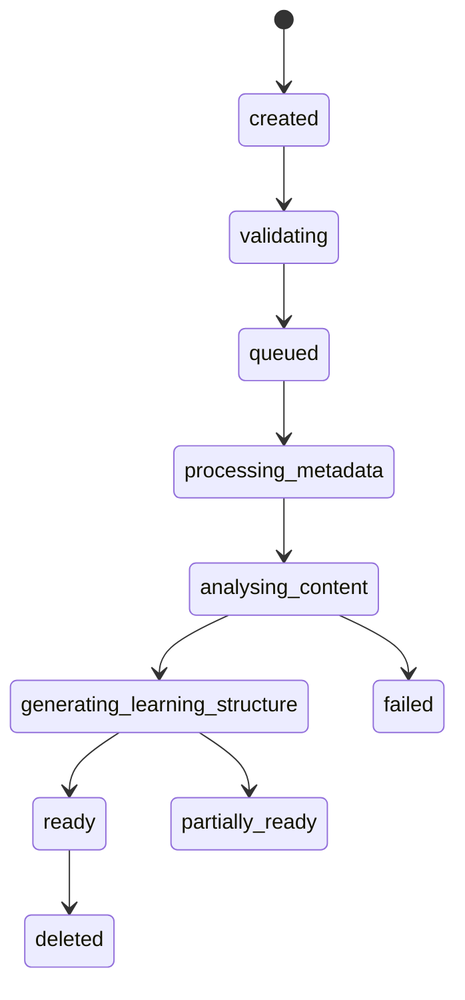

# AI Pipeline — ChatPye Workspace

## Overview

Provider lanes with a shared abstraction layer (`src/lib/ai/`). **See `docs/implementation/MASTER_PLAN.md` Section 3 for the approved routing model.**

| Lane | Provider | Scope |
|------|----------|-------|
| YouTube learning (analysis + Pye chat + study tools) | **Gemini** | Public YouTube URL via Interactions API |
| Custom upload learning | **Bedrock** + Transcribe | S3 → transcript → RAG chat |
| Workforce agents | **Bedrock** | Growth Plans, evidence analysis, reviews |

## Gemini — YouTube structured analysis

**Feature flag:** `FEATURE_GEMINI_YOUTUBE=true`  
**Quota:** per-user daily limit + platform circuit breaker

### Input

- Public YouTube watch URL (no download, no rehost)
- Optional: YouTube Data API for title/channel verification

### Output schema (validated with Zod)

```typescript
{
  title, description, summary,
  learningObjectives: string[],
  chapters: { title, startSeconds, summary }[],
  keyConcepts: string[],
  practicalSteps: string[],
  toolCues: ('excel'|'vscode'|'browser'|'figma')[],
  quiz: { question, options, correct, explanation }[],
  flashcards: { front, back }[],
  suggestedEvidence: string[],
  competencyCandidates: { name, level, rationale }[],
  sourceReferences: { type, label, ref }[],
  safetyNotes: string[]
}
```

Malformed output → retry with backoff (max 3) → `partially_ready` or `failed`.

### Caching

Cache **application-generated artefacts** only. Do not cache raw YouTube content as owned media.

## Bedrock — Pye tutor

### Context assembly

1. Structured resource summary + active chapter
2. Top-k transcript segments (uploads) or chapter text (YouTube)
3. Active task/rubric if in SkillProof mode
4. System prompt: tutor behaviour (graduated hints, no competence claims without evidence)

### Streaming

Use Bedrock streaming API; persist messages to `chat_sessions` with user consent controls.

### Safety

- Treat imported content as untrusted (prompt injection mitigation)
- Separate "from source" vs "general guidance" in response format
- Log latency/tokens/cost metrics — not full prompts by default

## Processing orchestration



Jobs enqueued to SQS; worker updates job row; SSE notifies workspace.

## Rate limits & cost controls

| Control | Scope |
|---------|-------|
| Gemini daily cap | Per user (Free: 3, Pro: 20, configurable) |
| Bedrock token budget | Per user + per org |
| Circuit breaker | Platform-wide Gemini failures > threshold |
| Concurrency limit | Worker max in-flight per queue |

## Adding a provider

1. Implement `AiProvider` interface in `src/lib/ai/providers/`
2. Register in `src/lib/ai/router.ts`
3. Add env vars to `.env.example`
4. Document in this file + unit tests for schema parsing

## Baseline code references

- `src/lib/video/transcript.ts` — Gemini YouTube interaction (transcript)
- `src/lib/learning/gemini-study.ts` — quiz/flashcards
- `src/app/api/chat/route.ts` — Bedrock RAG chat
- `src/lib/skillproof/task-plan.ts` — Bedrock task plans
