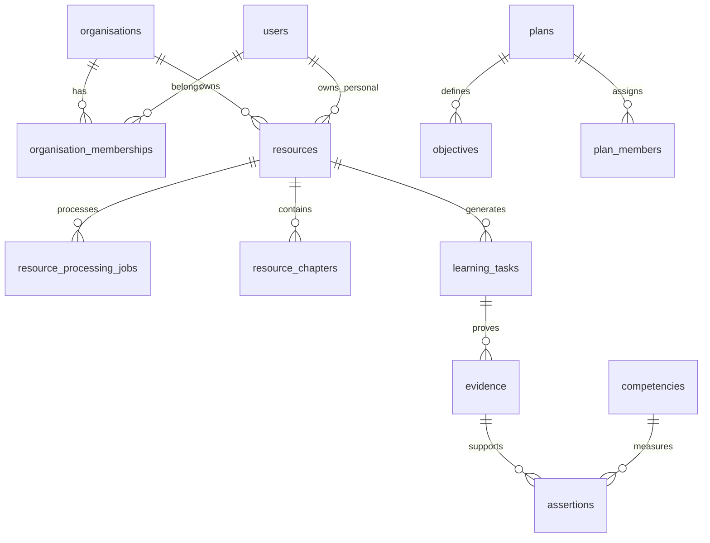

# Data Model — ChatPye Workspace

**ORM:** Drizzle · **Database:** Aurora PostgreSQL  
**Baseline schema:** `src/lib/db/schema.ts`  
**Baseline commit:** `27fb344c`

## Design principles

- UUID primary keys
- Tenant-owned rows include `organisation_id` where applicable
- Soft delete only for audit/recovery needs; otherwise hard delete with audit event
- Visibility enum on user-generated content
- Processing jobs separated from domain entities

## Entity map

### Identity & tenancy

| Table | Status | Notes |
|-------|--------|-------|
| `users` | Exists | Add sync from Clerk webhook |
| `organisations` | Exists | Map to Clerk org ID |
| `organisation_memberships` | **New M3** | clerk_user_id, org_id, status |
| `application_roles` | **New M3** | org-scoped roles |
| `permissions` | **New M3** | action-based |
| `role_permissions` | **New M3** | join table |
| `invitations` | **New M3** | org invites beyond pods |

### Learning resources

| Table | Status | Notes |
|-------|--------|-------|
| `videos` | Exists | **Evolve → `resources`** |
| `resources` | **New M1** | Canonical: youtube, pdf, url, video_upload |
| `resource_processing_jobs` | **New M1** | Attempt count, DLQ ref, progress |
| `resource_chapters` | **New M1** | Normalised from JSON blobs |
| `video_segments` | Exists | Keep for RAG on uploads |

#### Resource processing states

```
created → validating → queued → processing_metadata → analysing_content
  → generating_learning_structure → ready | partially_ready | failed | deleted
```

### Learning activity

| Table | Status |
|-------|--------|
| `learning_tasks` | **New M1** |
| `task_progress` | **New M1** |
| `video_notes` / `notes` | Exists (consolidate) |
| `bookmarks` | Exists |
| `video_quizzes`, `video_flashcards` | Exists (link to resource_id) |
| `quiz_attempts` | **New M1** |
| `chat_sessions`, `chat_messages` | Exists |

### SkillProof & competency

| Table | Status |
|-------|--------|
| `competency_frameworks` | **New M4** |
| `competencies` | Exists (extend) |
| `competency_levels` | **New M4** |
| `competency_relationships` | **New M4** |
| `evidence` | **New M1** (partial via skillproof API) |
| `evidence_files` | **New M2** |
| `assertions` | Exists (extend with review fields) |
| `assertion_reviews` | **New M4** |
| `learner_profiles` | Partial (`user_public_profiles`, `learner_competencies`) |

### Organisation programs

| Table | Status |
|-------|--------|
| `plans` | **New M3** (Growth Plans) |
| `plan_members` | **New M3** |
| `objectives` | **New M3** |
| `review_periods` | **New M3** |
| `reviews` | **New M4** |
| `courses`, `course_enrollments` | Exists → align with plans |
| `pods`, `pod_members` | Exists |

### Platform

| Table | Status |
|-------|--------|
| `share_links` | Exists |
| `subscriptions` | **New M5** (local Stripe mirror) |
| `usage_events` | **New M1** |
| `webhook_events` | **New M1** |
| `audit_events` | **New M4** |
| `data_retention_policies` | **New M5** |

## Migration strategy

### Step 1 — M1 (non-breaking)

1. Create `resources` table; backfill from `videos`.
2. Add `resource_id` FK on dependent tables (nullable during transition).
3. Create `resource_processing_jobs`.
4. Dual-write in import pipeline; read from `resources` first.

### Step 2 — M3

Add RBAC and Growth Plan tables; link assignments to `plans` not just `courses`.

### Step 3 — M4

Evidence lifecycle tables; migrate skillproof JSON blobs to `evidence` rows.

## Indexing guidelines

- `(organisation_id, created_at DESC)` on tenant tables
- `(owner_user_id, status)` on resources
- `(resource_id, start_ms)` on chapters/segments
- Unique `(organisation_id, slug)` on org-scoped slugs
- High-entropy unique index on `share_links.token`

## ER diagram (target core)



## Deprecations

- `user_xp`, `xp_activities` — remove after M1 (gamification out of scope)
- MongoDB collections — read-only during migration; delete in M2
