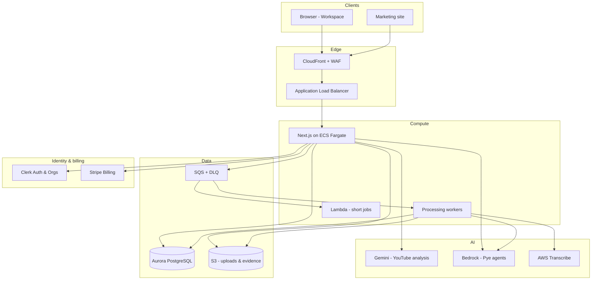

# System Overview — ChatPye Workspace

**Company:** Pye Interactive Limited  
**Product:** ChatPye Workspace (web) · **Pye** (AI tutor) · **SkillProof** (evidence & competency)

## Purpose

ChatPye turns learning plans, tutorials and real work into evidence employees can use in performance reviews — and managers can trust.

## Logical architecture

## Request flow — employee learns from YouTube

1. User authenticates via Clerk → session cookie.
2. User submits YouTube URL on `/app/import`.
3. API creates `resource` row (state: `created` → `queued`).
4. Worker invokes **Gemini** with public URL; validates JSON schema; persists chapters, objectives, quiz, flashcards.
5. Resource state → `ready`; workspace loads player + panels.
6. Pye chat queries **Bedrock** with retrieved structured context + citations.
7. Quiz/evidence actions write to Aurora; draft competency assertion created locally.

## Tenancy model

| Mode | Scope | Data isolation |
|------|-------|----------------|
| Personal | No org context | `owner_user_id`, visibility private by default |
| Organisation | Clerk org active | All queries include `organisation_id` |

Personal and organisation data must never mix in a single view without explicit consent.

## Key directories

| Path | Responsibility |
|------|----------------|
| `src/app/` | Routes (marketing, app, org, API) |
| `src/components/` | UI including workspace shell |
| `src/lib/ai/` | Provider abstraction, schemas, rate limits |
| `src/lib/db/` | Drizzle schema, repositories |
| `src/lib/resources/` | Resource model, processing state machine |
| `src/services/video-processor/` | Queue consumers (migrate to generic resource processor) |
| `infra/` | AWS CDK stacks |
| `lambda/` | Preprocess Lambdas |

## Current vs target deployment

| | Baseline (commit 27fb344) | Target |
|---|---------------------------|--------|
| Web host | Vercel | ECS Fargate + CloudFront |
| Database | Aurora + Mongo fallback | Aurora only |
| Jobs | HTTP tick + SQS partial | SQS + DLQ + workers |
| Auth sync | None | Clerk webhooks |

See `docs/architecture/AWS_ARCHITECTURE.md` for infrastructure detail.
